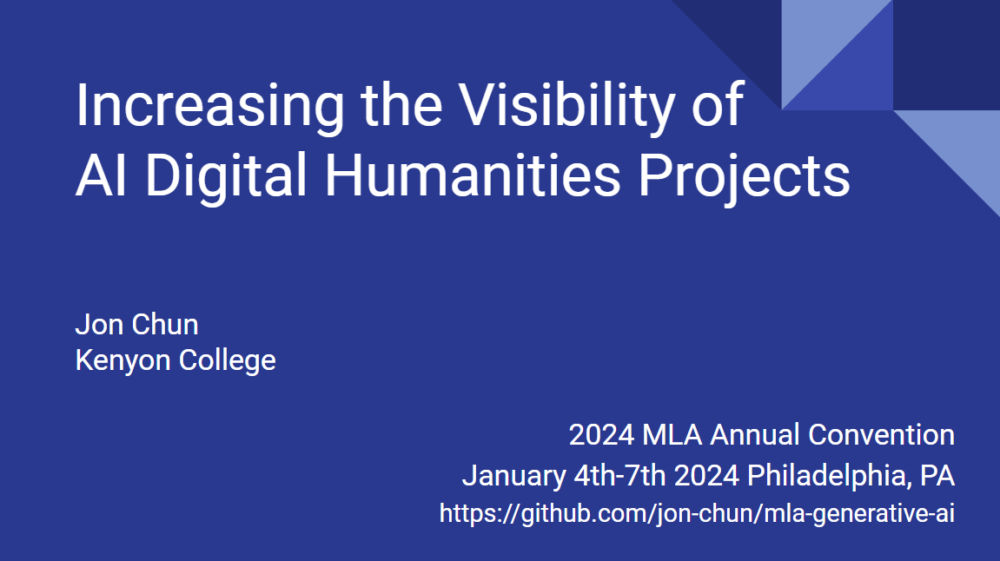
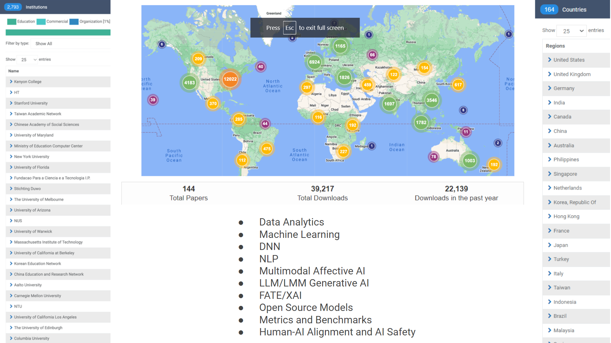

# [Modern Language Association 2024 Convention](https://www.mla.org/Events/2024-MLA-Convention)
* Jan 4th - 7th
* Philadelphia, PA

## [Session 616 – Making Digital Humanities Projects Public](https://mla.confex.com/mla/2024/meetingapp.cgi/Session/17982)
* 6 January 2024, 5:15 – 6:30 PM EST (Convention Program page)
* PPC - 202B (Grand Hall Level 2)

### Presider: Alison Booth, U of Virginia

* A Decade of NEH Digital Humanities Advancement Grant Promotion Plans and Deliverables
Katie Rawson, U of Pennsylvania

* Promoting DH Projects on Campus as a Method to Sustain and Scale Digital Humanities Efforts: A Case Study Ruth Carpenter, U of Binghamton, State U of New York

* Strategies for Promoting Student Digital Humanities Projects on Campus: A Case Study
Jon Chun, Kenyon C

* Disseminating Digital Texts as Open Educational Resources: Literature in Context
Tonya-Marie Howe1, John F. O'Brien2 and Christine Ruotolo2, (1)George Mason U, (2)U of Virginia

### Presentation

* [Promoting AI DH Projects in *.ppt](./MLA_Promoting_AI_DH_Projects_20230104.pptx)

* [Promoting AI DH Projects in *.pdf](./MLA_Promoting_AI_DH_Projects_20230104.pdf)

* [Promoting AI DH Projects in *.pdf with links](./MLA_Promoting_AI_DH_Projects_20230104_with_notes.pdf)

### Description

How can we improve existing approaches for inventorying and discovering digital humanities projects? We invite 100-word summaries for a roundtable on methods and best practices for promoting digital humanities work.

### Comment

This presentation highlights a proven approach to visually communicate AI digital humanities research in poster format. We will cover an origin arising from scientific poster sessions and subsequent modification in narrative and design best suited for a wide diversity of human-centered AI research.

### Proposal

I will share best practices for how we have gained visibility of student AI digital humanities projects at a small liberal arts college. Since founding the world’s first human-centered AI curriculum in 2016, https://digital.kenyon.edu/dh has had over 40k downloads from 160 countries worldwide. We learned traditional essays and even beautifully crafted websites rarely reach their intended audience. Instead, we’ve developed a distinct research poster format derived from scientific disciplines. Based upon our analytics, I will share the narrative and design elements that have yielded the highest visibility.

### Analytics (on 4 Jan 2024)

